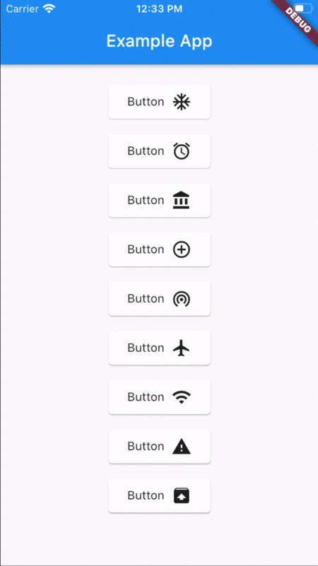

# Flutter Global Animations
[](https://pub.dev/packages/flutter_global_animations)

A flutter plugin to play custom global animations in your application.

## Example



## Usage

### Import
```dart
import 'package:flutter_global_animations/flutter_global_animations.dart';
```

### Create your own animation

```dart
class IconReaction extends AnimationModel {
  IconReaction({
    @required Offset position,
    @required Size region,
    @required IconData icon,
  }) : super(
          position: position,
          region: region,
          duration: Duration(milliseconds: 600),
          count: 10,
          data: icon,
        );

  final maxHeight = 300;
  final minDY = 0.3;
  final maxDX = 0.2;
  final minSize = 30;
  final maxSize = 80;

  CurvedAnimation _fadeCurve;
  CurvedAnimation _posCurve;

  @override
  AnimationController createController(TickerProvider vsync) {
    AnimationController controller = super.createController(vsync);

    _fadeCurve = CurvedAnimation(parent: controller, curve: Cubic(0.9, 0.0, 1.0, 1.0));
    _posCurve = CurvedAnimation(parent: controller, curve: Curves.easeOut);

    return controller;
  }

  @override
  Entity createEntity() {
    final entity = super.createEntity();

    double dy = -(random.nextDouble() * (1 - minDY) + minDY);

    entity.dy = dy;

    return entity;
  }

  @override
  Widget buildEntity(Entity entity) {
    return Opacity(
      opacity: 1 - _fadeCurve.value,
      child: Container(
        child: Directionality(
          textDirection: TextDirection.ltr,
          child: Icon(
            data,
            size: 24,
            color: Colors.lightBlue,
          ),
        ),
      ),
    );
  }

  @override
  Offset getEntityPosition(Entity entity) {
    double posX = entity.dx * (_posCurve.value * region.width);
    double posY = entity.dy * (_posCurve.value * maxHeight);

    return Offset(posX, posY);
  }
}
```

### Wrap your app in `GlobalAnimationsWrapper`

```dart
class ExampleApp extends StatelessWidget {
  @override
  Widget build(BuildContext context) {
    return GlobalAnimationsWrapper( // <-- HERE
      child: MaterialApp(
        title: 'Example App',
        debugShowCheckedModeBanner: false,
        theme: ThemeData(
          splashFactory: InkRipple.splashFactory,
        ),
        home: HomePage(),
      ),
    );
  }
}
```

### Spawn an animation

```dart
...
child: InkWell(
  onTap: () {
    RenderBox renderBox = context.findRenderObject();
    Size size = renderBox.size;
    Offset position = renderBox.localToGlobal(Offset.zero);

    GlobalAnimations.of(context).spawn(
      IconReaction(
        position: position,
        region: size,
        icon: icons[index],
      ),
    );
  },
...
```
